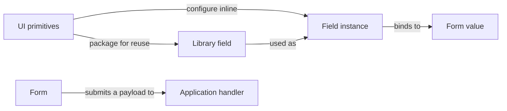

# Part 3 — Mental Model

**Start with a form and its fields. Add layout, conditions, reuse, sections, or pages only where the experience needs them.**

A **field instance** is a configured input bound to a value in the form. It can be declared ad hoc, in the same spirit as configuring a React control with props. A **library field** optionally packages a field for reuse: `CostCentre` might carry its picker, search, and validation, then be used independently for requesting and billing. Both paths produce ordinary fields in the same composition model.

This is the proposed conceptual model for the APIs, grounded in [Part 1](01-product-vision.md) and [Part 2](02-design-principles.md). The examples describe intended behaviour; they are not a published API.

## Start with the smallest form

The minimum composition is **Form → Fields**:

```text
form Contact submit application.saveContact
  field name
    control: Input
    label: Name
    rules: required
  field email
    control: Input
    label: Email
    rules: required, valid email
  action submit
```

This is an authoring bar, not chosen syntax: one declaration per field, one ordinary value key, and a submit connection. Default integration supplies binding, error presentation, validation coordination, and form completion. No Page, Section, library field, registry, separate workflow declaration, or repeated presentation list is required.

The [simple-form rubric](03-scenarios/simple-form.md) tests this baseline and the independent additions that must remain easy.

## Add boundaries when they have a purpose

A larger experience may use this arrangement; it is not a list of compulsory layers:

```text
Form                             Shares values, requirements, and action state
  Page (optional)                Groups content, navigation, and completion
    Section (optional)           Groups related fields and their behaviour
      Field instance             Binds a configured control to a form value
```

A page is a named part of the form, whether shown at its own URL, in a tab, or as a wizard panel. Sections group field instances and their relationships; pages present those existing uses. Either can be used without the other. A section can span pages without splitting its values or internal wiring, and sections can nest. A form with neither has field and form state directly; there is no default page the author must identify, visit, or complete.

The useful part of the mixin analogy is **adding capabilities where needed**. Layout can apply directly to the form, a condition directly to a field, and a cross-field rule directly to the form. None requires a new wrapper. Pages and sections are optional meaningful boundaries, with additional navigation or group state when wanted; they are not prerequisites for those capabilities.

Ordinary React component extraction also needs no semantic Section or library registration. Use a Section when the group itself needs a name, shared requirements, completion, or a reusable interaction boundary. There is no need to introduce a separate mixin system or inheritance chain.

Form is the logical interaction boundary; it need not correspond to one permanently mounted HTML `form` element.

Fields can be configured inline or drawn from a library. Submission describes what the form does with their values:



The hierarchy describes how an experience is assembled. **Bindings determine data shape; pages group the experience; layouts and routing determine its presentation. The workflow defines navigation and actions.** A visual parent does not automatically become a parent in the payload. A review page can show existing field instances without creating more of them.

A layout such as a grid, stack, or card is presentation configuration on a form, page, or section. It arranges existing content and adds no data or progression layer of its own.

## What each part is responsible for

| Part | Why it exists | Responsibilities and boundary |
| --- | --- | --- |
| **UI primitive** | Supply the UI building blocks. | HTML and local shadcn controls such as Input, Select, Checkbox, Label, and error text. They provide rendering and control interaction. Field configuration supplies binding and form behaviour. |
| **Field instance** | Give an input its identity, binding, and behaviour. | Configure its control, props, validation, and dependencies directly, or use a library field with local configuration. Its current value and interaction state belong to the running form. |
| **Library field — optional** | Package a useful field for reuse. | A reusable value contract, rendering, validation, behaviour, and defaults. Examples: Email, CostCentre, EmployeePicker, AWSRegion. It declares inputs or services it needs. A field does not need this extra authoring step. |
| **Section — optional** | Reuse or organise related fields as a coherent interaction. | Group field instances and nested sections with a default layout, internal dependencies, and rules spanning those fields. It may bind into an object or be repeated over an array when explicitly configured. Grouping alone creates neither. |
| **Page — optional** | Give a part of the form a stable identity, content, and completion scope. | Present existing fields, sections, or review content. Declare page requirements and actions. A route, tab, or wizard panel can present the same page; its label or path does not determine its identity or value bindings. |
| **Layout — presentation configuration** | Arrange the content a composition presents. | Ordered child presentations and ordinary CSS on its container, with placement for individual children. Control-specific styling and keyboard behaviour stay with the selected renderer/primitive. |
| **Form** | Provide the shared boundary for the whole interaction. | Compose fields, sections, and pages; share values and requirements; expose form completion, draft and action state, and the submission contract. The default value engine remains React Hook Form. |
| **Workflow** | Describe how the form behaves over time. | Define page availability, navigation, guards, dependencies, and action handoffs. These rules coordinate the form; they do not require another enclosing value store or a second container around every page. |
| **Submission** | Hand the collected information to the application. | Normally validate applicable requirements and pass the current included bound values to a handler. Custom mapping or action scope is added when needed. The application can accept, reject, or request further input. Submission is an action and result, not another container. |

## A page can be a route, a tab, or a wizard step

**Page is the construct; a wizard step is one way to use it.** An ordered workflow can present Account, Region, and Review as successive steps. Another presentation can show those same pages as tabs or map them to routes. There is no need to declare both a Page and a Step around the same content.

Page identity, value bindings, requirements, and completion survive that choice. The form's navigation policy decides whether pages can be visited freely or only after prerequisites pass. A direct URL, a tab click, and a Next button must respect the same policy when presenting the same workflow. Routes and tabs do not define different validation semantics.

Page changes share the same running form state, including when inactive UI unmounts. Full document navigation requires saving and restoring a draft if it destroys that runtime. Restored completion is re-evaluated; a stored green tick is not evidence that current requirements still pass.

## Layout arranges the presentations

A form, page, or section can define its layout using ordered children and normal CSS classes/styles. `display: grid`, `gap`, column definitions, flexbox, and responsive rules should work as they do in owned React UI. A plain row wrapper needs no new semantic Section.

Keep three targets clear: **container layout**, **child placement**, and **control props**. A field's column span applies to its presentation in the container; its placeholder or Select trigger class belongs to the supported control interface. Parent layout props are not automatically spread into the primitive.

The ordered presentations establish the logical reading sequence. CSS arrangement should preserve meaningful reading and keyboard order; visual positioning alone does not establish a new tab sequence. Focus preferences are related interaction behaviour: the page can request initial or error focus by field reference, while the renderer resolves the actual control and owns its internal keyboard behaviour.

Classes and documented state attributes provide styling hooks. They are not field references or another way to set completion. The [layout and presentation model](03-layout-and-presentation.md) specifies these boundaries; the [responsive-layout sketch](03-scenarios/responsive-layout.md) shows their manifestation in pseudocode and ordinary CSS.

## Declare inline, reuse when useful

An ordinary input should be straightforward to declare where it is used: choose a control, bind it, and supply props such as placeholder, label, or help text, plus any validation or dependencies. This requires no prior named field definition, reusable component, or registry entry.

Inline fields and library uses participate in the same state, validation, and completion model. Formulate's binding/control integration supplies the shared behaviour; a bare unbound UI control is not automatically a form field. Local names or handles should become available when another rule needs a reference, without a separate reference declaration for every ordinary input.

A **library definition** packages configuration when reuse is useful. It can live locally or in an organisation package. Extracting an inline field into one should preserve its identity, binding, value contract, rules, and current behaviour. Inline and library-backed fields can be mixed freely, including inside reusable sections and pages. Installing source from a registry is a separate distribution concern.

An **instance** is one field occurrence, declared inline or from a library, with its own identity, binding, and configuration. Two CostCentre uses can share the definition and lookup service while having different labels, organisations, values, and errors. Changing one use must not mutate the other or the shared definition. Adding a constraint preserves inherited validation; changing the underlying contract is an explicit adaptation.

Sections and pages can likewise be declared inline and extracted for reuse when useful. A reusable page can package fields or sections, or accept references to existing uses. Its presentation and requirements refer to those same instances. The containing form connects outside inputs and navigation.

**Current values belong to a running form.** Two people using the same definition have independent state. Remounting a React control does not create a new conceptual field instance. React Hook Form is the default value authority; Formulate coordinates interaction rules. Local UI state such as an open popover can remain in the renderer.

### When a composed field becomes a section

**A field exposes one field contract and binding. A section composes multiple field instances.** Count contracts, not controls or object properties.

A DateRange field can use two controls and expose one `{ start, end }` value, including errors on `end`. Account and Region are separate fields when each needs its own binding, requirements, or placement. An address can likewise be one encapsulated object-valued field or a section of separately composed fields. No additional “compound field” layer is required.

## Reference fields where the relationship is composed

**A condition reads a reference to a particular field in this section, page, or form.** Local references should feel like ordinary variables or props:

```text
form Settings
  field showAdvanced
    control: Checkbox
    initial: false
  field retries
    control: Input, numeric
    visible when showAdvanced.value
```

`showAdvanced` names the checkbox declared here; `.value` in this condition is a live dependency. A section or page can compose the same relationship when that scope is useful, but this condition needs neither. It does not need a library definition or a full path lookup. Moving either presentation preserves the resolved reference.

A reference identifies the source; the effect says whether its value controls visibility, applicability, requiredness, or another behaviour. Here it changes visibility only. A reused section's local names resolve to its own field instances; dependencies outside that reusable piece are supplied by its caller. The [references and relationships model](03-references-and-relationships.md) and [advanced-options sketch](03-scenarios/advanced-options.md) develop these boundaries.

## Compose once, connect each use

A reusable `DeploymentTarget` section contains an Account field and an AWSRegion field. The region field takes the section's account as an input. The section carries that connection and the behaviour that rechecks the selected region when the account changes.

The containing form supplies each use's identity, value bindings, and application services. Internal references resolve within that use; dependencies outside it must be connected explicitly.

| Section use | Account binding | Region binding | Dependency |
| --- | --- | --- | --- |
| `primaryTarget` | `targets.primary.accountId` | `targets.primary.regionId` | Primary region uses primary account. |
| `recoveryTarget` | `targets.recovery.accountId` | `targets.recovery.regionId` | Recovery region uses recovery account. |

Changing the primary account rechecks the primary region. It has no effect on the recovery selection unless the form declares a rule connecting them. A rule requiring the two targets to use different regions belongs to the containing form, which knows both uses.

Dependencies and rules belong with the smallest reusable composition that has the information to express them. An external requirement is an input to connect, not a path the reusable definition guesses. Rules affecting validity or progression must remain available when a field's UI is unmounted or replaced by custom React.

### Identity survives rearrangement

The **instance identity** identifies this field; the **binding** locates its value. When it comes from a library, the **definition name** also identifies what is reused. Inline fields need no such name. The API can infer identities and bindings where unambiguous without demanding manually repeated strings.

A grid wrapper, another page, or a review view preserves the existing identity and binding. Reviewing references the same instance; another use of its library definition creates an independent instance. Duplicate identities and competing writable bindings require useful errors, including a DateRange at `period` competing with another field at `period.end`. Section object bindings only route their children's bindings.

Repeating a section creates distinct uses under an explicitly bound array. Stable item identities keep values, errors, and dependencies together when reordered; current array indexes cannot provide that identity.

## State and completion at every layer

**Fields, sections, pages, and the form each expose their current state and completion.** Higher layers summarise the same underlying values and requirement results, rather than keeping separate editable copies.

Only the layers actually used need those summaries. A form containing direct fields already has validation, errors, and form completion; adding a Section or Page introduces another useful scope, not previously missing machinery.

| Layer | Completion means |
| --- | --- |
| **Field** | This use satisfies its applicable requirements against its current value and dependencies. |
| **Section** | Its applicable members and its own cross-field or collection rules are satisfied. |
| **Page** | The requirements assigned to this page, including any page-specific conditions, are satisfied. |
| **Form** | All applicable field, section, required page, and form-wide requirements are satisfied, including those outside named pages. |

A section split across pages need not be complete for its first page to be complete. The Account page can finish while Region is empty; the DeploymentTarget section and form still have work remaining. Conversely, every page's local checks can pass while a form-wide rule fails. The form must explain that failure and where it can be corrected.

A useful indication is **Incomplete, Checking, Complete, or Not applicable**, backed by the actual requirement results. Completion is current and reversible: changing an earlier answer can revoke a later page's completion. Optional empty values and valid prefills can satisfy their contracts without being touched. Unknown or stale validation must not produce a completed indication.

Keep dirty values, touched fields, visited pages, pending checks, and save/submission acknowledgements distinguishable. A page can be complete but unsaved, or visited but incomplete. Review references existing values; an explicit requirement to acknowledge the current summary must be satisfied separately.

The [state and completion model](03-state-and-completion.md) defines these rollups, route/tab behaviour, baseline and save distinctions, and a worked completion sequence. No page or section owns another value store.

## Behaviour follows the composition

Applicability, visibility, retention, validation, payload inclusion, and permitted actions remain distinguishable. For a production-only section, an explicit policy can retain values after switching to development, skip production requirements, and omit those values from submission. Returning to production rechecks them. Hiding a panel or leaving a page has none of those consequences by itself.

Applicability narrows through containing sections; a child cannot reactivate an inapplicable parent's requirements. Page availability governs navigation. A relationship between a page's availability and its content's applicability must be declared rather than inferred from which page is open.

Validation has an action scope. Account's Next action can proceed before Region is filled in; final submission checks both. Changes to Account recheck Region and affected completion, even when its page is unmounted. Default rendering, custom React, and a future agent consumer must use the same requirements and actions. [Part 6](design-notes.md#workflow-semantics--part-6) must make these scopes and defaults concrete.

## Submission completes an interaction, not necessarily the business process

Ordinary submission uses documented defaults to validate applicable form requirements and pass the current included bound values to its handler. In the simple example that is the `name` and `email` object; it requires no payload mapper. Custom inclusion, reshaping, or scoped actions are declared when needed. Under the production example's retain-and-exclude policy, retained production values are omitted while in development. Each payload is a snapshot for its attempt.

Defaults must be inspectable, but the author should not restate normal engine, retention, error timing, focus, or submission policies on every form. The detailed policy examples in the companion documents make their consequences reviewable; they are not mandatory boilerplate for all authoring.

The application handler owns the business operation. For Terraform provisioning, acceptance can mean “request accepted” while the application continues planning, approval, and execution. Formulate can present status and requests for more input through explicit handoffs without becoming the durable provisioning engine.

A rejection belongs to the corresponding attempt and affected fields or form. It preserves useful work and provides a next action. Saving a draft, validating a page, and submitting are distinct actions; each can have its own scope without creating another composition layer.

## Pressure tests and the API bar

Start with the [simple-form rubric](03-scenarios/simple-form.md), then add only what a scenario needs. The [seven hero scenarios and focused sketches](03-scenarios/README.md) exercise larger compositions; the [adversarial checks](03-mental-model-pressure-tests.md) challenge their relationships. These are conceptual acceptance cases, not evidence of a working runtime.

The model must remain easy to say aloud:

> This form uses two deployment-target sections. Each has its own account and region fields, built from the same library definitions. Pages present configuration and review as routes, tabs, or wizard steps. Each layer shows what is complete. The workflow coordinates navigation and submission to the application.

Parts 4–6 must make that statement equally easy to express in code. Convenient inline composition and explicit references should describe the same underlying uses, without forcing duplicate field declarations, manual namespacing, or a separate rule set for custom rendering. Parts 7–8 will define portable references, component compatibility, and distribution; those mechanisms do not add layers to this mental model.
